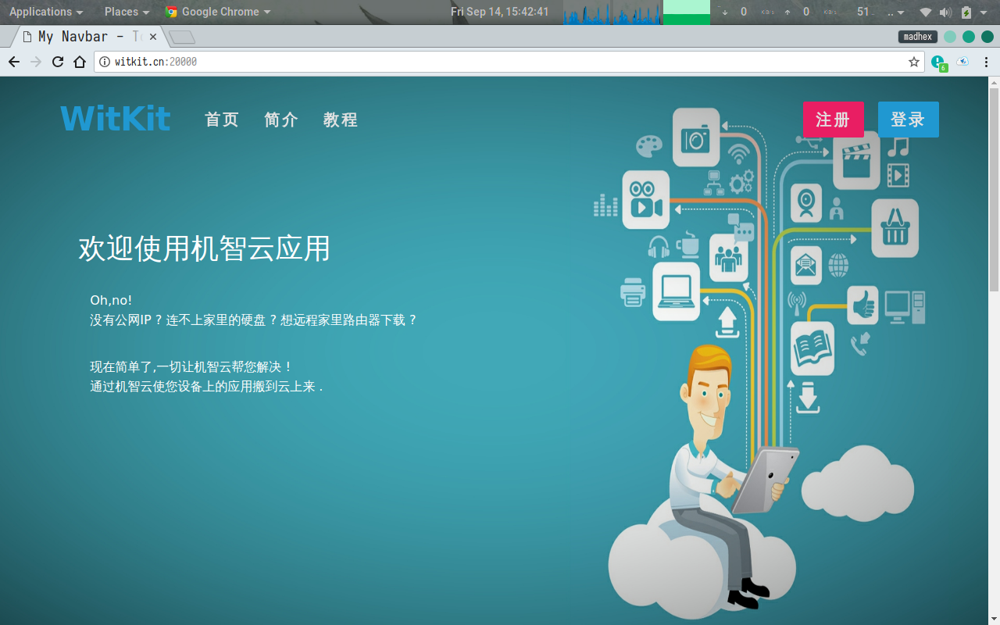
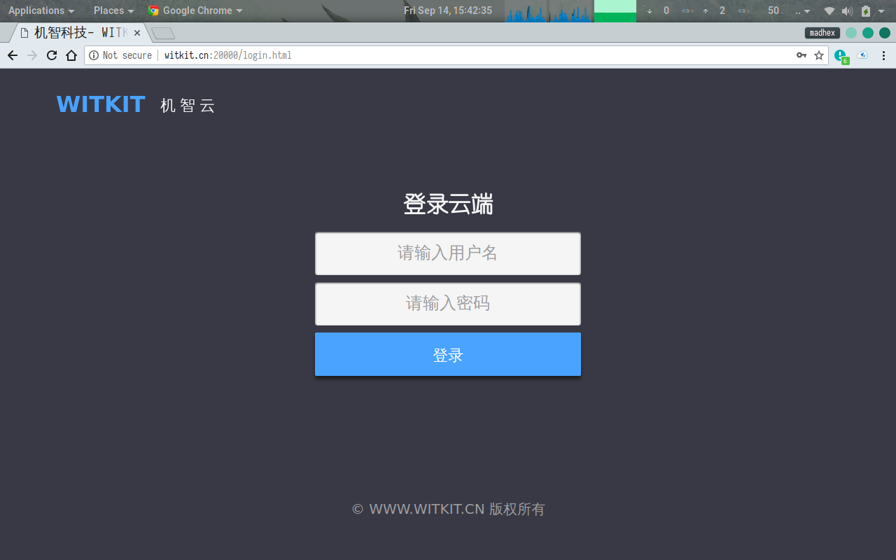
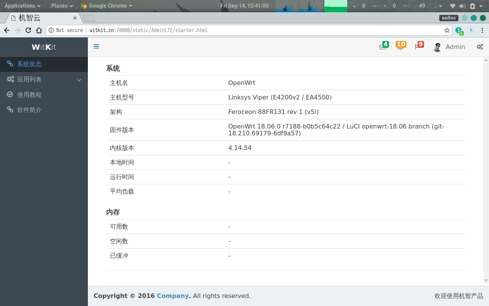
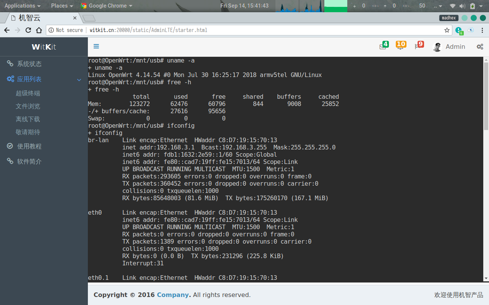
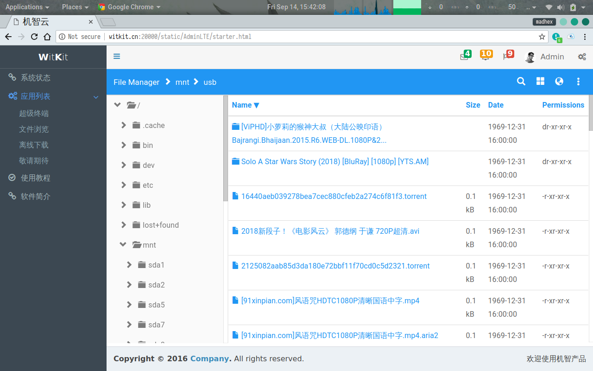
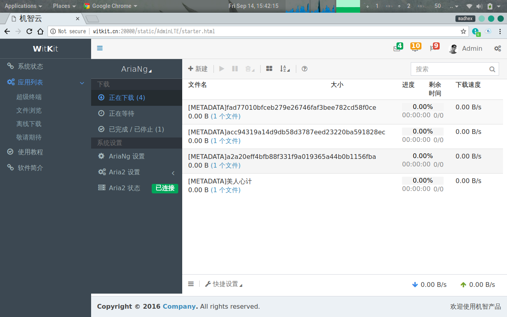

# witcloud
Access your device any where over the web 

在任何地方只要通过web就可以访问你的终端设备

暂时支持:

1. 超级终端 - ttyd
2. 文件浏览 - angular-filemanager
3. 远程下载 - AriaNg

未来准备支持:

1. 一个账户下的多个设备互通 - n2n 

2. 邮件发送接收

3. 等等

   

